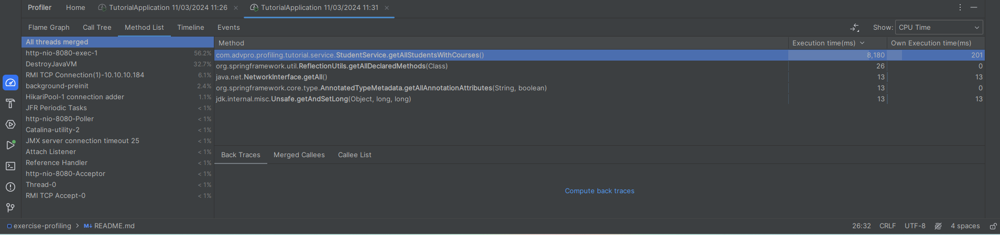
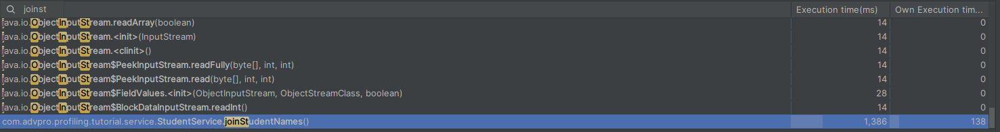
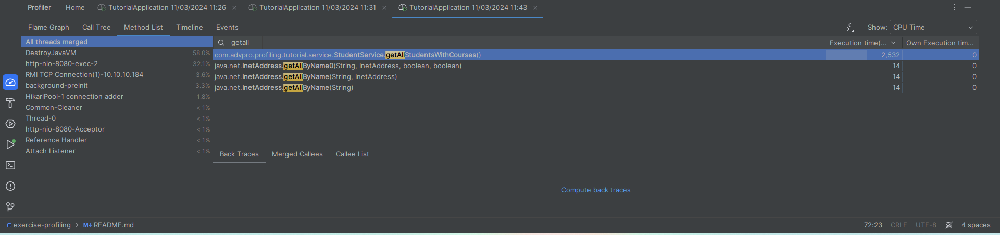
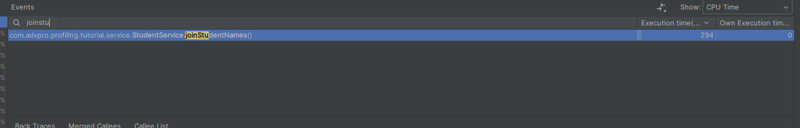

### Before Optimizing

Performance Testing JMeter:

/all-student
- using JMeter GUI

- using JMeter CLI

- using IntelliJ Profiler

/all-student-name
- using JMeter GUI

- using JMeter CLI

- using IntelliJ Profiler

/highest-gpa
- using JMeter GUI

- using JMeter CLI

- using IntelliJ Profiler

### After Optimizing

Profiling (CPU time reported in the method list tab)

/all-student
- using JMeter GUI

- using IntelliJ Profiler

Apabila dibandingkan dengan pengukuran sebelumnya, ada improvement di sample time dari pengukuran JMeter yaitu berkurang dari 360000-450000 menjadi 11000-13000.

/all-student-name
- using JMeter GUI

- using IntelliJ Profiler

Apabila dibandingkan dengan pengukuran sebelumnya, ada improvement di sample time dari pengukuran JMeter yaitu berkurang dari 10000-12000 menjadi 100-450

/highest-gpa
- using JMeter GUI

- using IntelliJ Profiler

Apabila dibandingkan dengan pengukuran sebelumnya, ada improvement