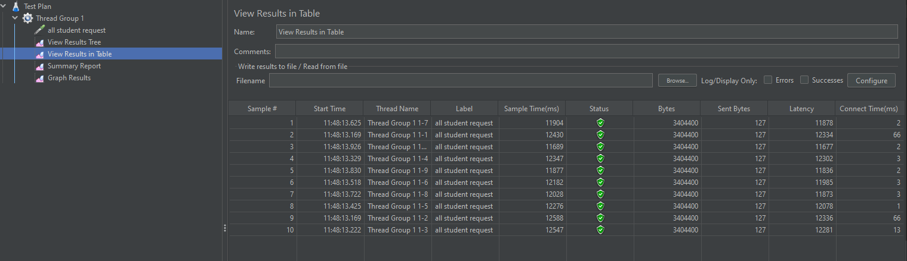

### Before Optimizing

/all-student
- using JMeter GUI

- using JMeter CLI

- using IntelliJ Profiler

/all-student-name
- using JMeter GUI

- using JMeter CLI

- using IntelliJ Profiler

/highest-gpa
- using JMeter GUI

- using JMeter CLI

- using IntelliJ Profiler

### After Optimizing

/all-student
- using JMeter GUI

Apabila dibandingkan dengan pengukuran sebelumnya, ada improvement di sample time dari pengukuran JMeter yaitu berkurang dari 360000-450000 menjadi 11000-13000.
- using IntelliJ Profiler

/all-student-name
- using JMeter GUI

Apabila dibandingkan dengan pengukuran sebelumnya, ada improvement di sample time dari pengukuran JMeter yaitu berkurang dari 10000-12000 menjadi 100-450

- using IntelliJ Profiler

/highest-gpa
- using JMeter GUI

Apabila dibandingkan dengan pengukuran sebelumnya, ada improvement di sample time dari pengukuran JMeter yaitu berkurang dari 300-422 menjadi 9-255

- using IntelliJ Profiler

Kesimpulan:
- Dari semua proses optimasi selesai, performance dari program yang saya buat menjadi lebih tinggi. Hal ini dibuktikan dengan menurunnya waktu yang dibutuhkan program untuk merespon terhadap suatu request.

## Reflection
1. Perbedaan dari JMeter dan IntelliJ Profiler:
    - JMeter hanya menghitung sample time dari request disampaikan sampai respond diterima.
    - Sedangkan Intellij Profiler mampu mmenghitung juga waktu eksekusi setiap method yang dipanggil.

2. Proses profiling mampu membantu saya mengidentifikasi dengan cara melihat flame tree, method list, dan timeline, dimana akan terlihat bagian kode yang mana yang memakan waktu paling banyak.

3. Menurut saya Intellij Profiler sangat efektif dalam membantu saya menemukan penyebab program saya yang lambat karena mampu dengan jelas memberikan CPU Time tiap method yang dipanggil.

4. Tantangan yang saya hadapi ketika mengukur performance testing dan profiling adalah tampilan UI yang belum saya familiar, hasil performance-nya tidak konsisten sehingga kurang merepresentasikan kecepatan yang sebenarnya, serta sulit mencari kode lambat yang masih dapat diimprove karena method-method di library yang tidak saya otak-atik juga diukur oleh profiler.
Cara saya menghadapi challange ini adalah dengan membuat test lebih banyak (seperti thread group) serta membaca lebih banyak dokumentasi tentang performance testing dan profiling.

5. Saya bisa dengan mudah mencari kode yang masih dapat dioptimize dengan cepat. 
Dibanding tidak menggunakan profiling sama sekali, pasti saya harus mencari penyebab kode saya lambat dengan cara membaca semua kode satu-satu, serta apabila ditemukan biasanya hanya berpengaruh sedikit terhadap performa.

6. Saya menangani situasi dimana hasil dari profiling yang tidak konsisten dengan JMeter dengan membuat lebih banyak testing seperti thread group atau menghindari pengukuran pertama kali saat program berjalan karena JIT compiler pada JVM belum sepenuhnya optimal sehingga menjadi lebih lambat.

7. Strategi untuk mengoptimize code adalah membuat database yang berisi banyak sekali data, kemudian melakukan profiling terhadap endpoint-endpoint yang ada. Dengan begitu akan terlihat jelas perbedaan waktunya apabila ada bagian kode yang di-optimize. Contoh kode yang dapat diperbaiki adalah dengan mengganti rekursif menjadi iteratif seperti for/while loop. Kemudian menggantikan string menjadi StringBuilder untuk meningkatkan performa.
Agar perubahan saya dipastikan tidak mengganggu fungsionalitas dari aplikasi, perlu dijalankan ulang unit tests dan functional test.